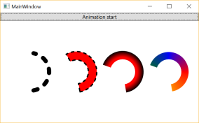

# Arc Shape for .NET

Arc (弦) を描くためのShapeクラス実装です。



- Arcプロジェクト: 本体
	* Arc
		+ Strokeでarcを描きます。
		+ 先を丸くするとか、弦自体を点線にするとか。
	* ThickArc
		+ 太いarcのアウトラインのShapeです。
		+ 先を丸くしたり、弦自体を点線にはできませんが、輪郭線を描くことができます。
	* ArcGeometryCreator
		+ ArcのGeometryを作成するためのクラスです。
		+ GeometryはClip等に使えます(TestApp参照)。
	
- TestAppプロジェクト: 使用例 (画像)
	* 左から順に、Arc, ThickArc, ArcGeometryCreatorでのClip1, Clip2
	* Clip2のグラデーション塗りつぶしは [Gradient Brush along a Circular Path (StackOverFlow)](http://stackoverflow.com/questions/4839666/creating-gradient-brush-along-a-circular-path) を参考に
	* 上のボタンを押すとくるくる回ります

- Dependency Properties
	* StartAngle
	* Angle
	* IsClockwise
	* IsPie

```
Copyright (c) 2016 hirekoke
Released under the MIT license
http://opensource.org/licenses/mit-license.php
```
